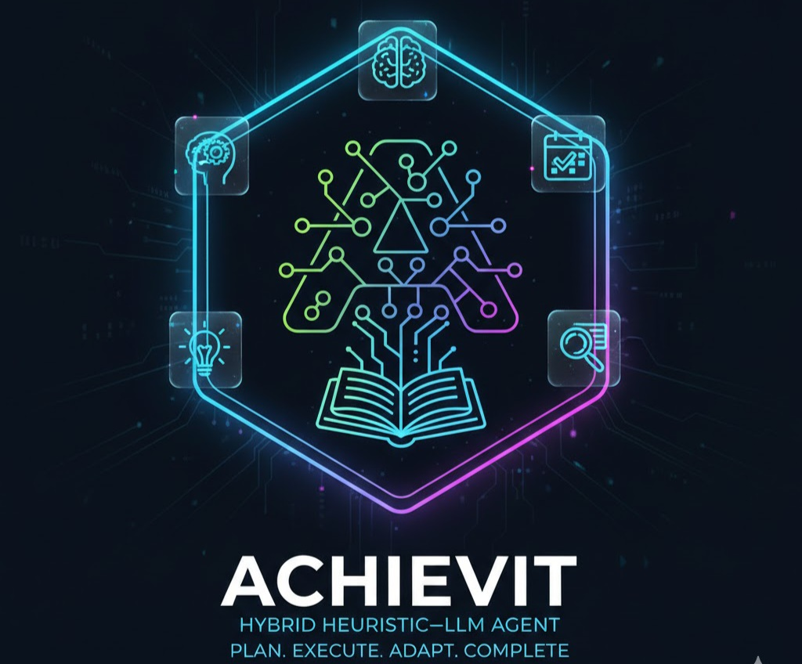

# ACHIEVIT
**An LLM-Powered Academic Companion for Goal Achievement**

---

**ACHIEVIT** is a Large Language Model-powered adaptive intelligent system designed to help **students and researchers achieve academic goals** to structure, track, adapt and achieve their goals— such as studying for exams, completing assignments, or writing dissertations—under real-world constraints like limited time, skill level, and deadlines.

Unlike generic productivity tools, ACHIEVIT is a stateful adaptive system that combines **heuristic logic** with **large language model (LLM) reasoning** to deliver **adaptive, context-aware guidance** that evolves as the user makes progress on their goals. Basically, it support students and researchers in setting their super-importnat goals, break them into achievable milestones and ensure that they achieve it

---

  

---

## 🚀 Key Features

### 🎯 Goal-Oriented Planning
- Achievit supports multiple academic goal types:
  - **Exams**
  - **Assignments**
  - **Dissertations / Theses**
- Transforms high-level goals into **clear, actionable milestones**

---

### 🧠 Hybrid Intelligence Architecture

  

- **Heuristic Logic**
  - Deterministic milestone generation
  - Constraint handling (time, skill level, deadlines)
- **LLM Reasoning (Gemini)**
  - Adaptive planning and replanning
  - Optimization strategies
  - Context-aware academic guidance
  
This hybrid approach ensures plans are **structured, feasible, and intelligent**.

---

### ⏱️ Constraint-Aware Planning
Goalpanion explicitly accounts for:
- Daily time availability (hours per day)
- Skill level (Novice / Intermediate / Expert)
- Fixed deadlines

Plans are designed to be **realistic and achievable**, not idealized.

---

### 🔁 Progress-Aware Adaptation
- Users track milestone progress:
  - *Not started*
  - *In progress*
  - *Completed*
- The LLM dynamically:
  - Updates remaining steps
  - Adjusts schedules
  - Suggests time-optimization strategies
  - Recommends relevant academic resources

---

### 🧑‍🤝‍🧑 Human-in-the-Loop Design
- Interactive **Streamlit-based UI**
- Sidebar control panel for goal selection and constraints
- Users remain in control of:
  - Planning
  - Progress updates
  - Decision-making

Goalpanion supports users—it does not replace them.

---

## 🎯 Target Users

- Undergraduate and postgraduate students
- Graduate researchers and PhD candidates
- Self-directed learners with academic goals
- Developers exploring **LLM agent systems with observability**

